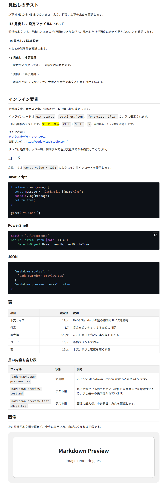

# vscode-markdown-style

VS Code の Markdown プレビュー用 CSS です。どのフォルダの `.md` でも、同じ見た目で表示できます。



## 特徴

- エディタのテーマ（ダーク/ライト）に関係なく、プレビューは白背景のライト表示になります。
- 文字サイズは、VS Code の設定 `markdown.preview.fontSize` に従います。
- 本文は左端から表示され、最大幅は 860px です。
- 表は、画面幅が狭くなっても列が潰れにくくなっています。
- コードブロックは暗い背景で、色分けは VS Code のテーマの色がそのまま使われます。

## ファイル

| ファイル | 内容 |
| --- | --- |
| `markdown.css` | 基本のスタイルです。 |
| `dads-markdown-preview.css` | 同じ意図で、見た目を少し変えたものです。 |

## 使い方

1. VS Code の左下の歯車ボタン →「設定」を開きます。
2. 検索欄に `markdown.styles` と入力し、「ユーザー」タブを選びます。
3. 「項目の追加」を押し、次の URL を入力して「OK」を押します。

```
https://cdn.jsdelivr.net/gh/Neylonoron/vscode-markdown-style/markdown.css
```

`settings.json` に直接書く場合は、次のとおりです。

```json
"markdown.styles": [
  "https://cdn.jsdelivr.net/gh/Neylonoron/vscode-markdown-style/markdown.css"
]
```

別のスタイルを使う場合は、URL の `markdown.css` を `dads-markdown-preview.css` に変えます。両方を同時に指定すると、後ろのものが前のものを上書きして、見た目が混ざります。

### 設定の注意点

- `markdown.styles` は、https の URL か、開いているフォルダ内のファイルへの相対パスしか読み込めません。そのため、全フォルダで共通にするには、URL で指定する方法が簡単です。
- jsDelivr は、URL をキャッシュします。CSS を更新しても古い表示が残る場合は、URL の末尾に `?v=2` のようなクエリを付けて、更新のたびに数字を上げてください。

## 出典

このスタイルシートの色・文字サイズ・行間などの値は、デジタル庁デザインシステム（DADS）を参考にしています。

- 出典: デジタル庁デザインシステムウェブサイト https://design.digital.go.jp/dads/ をもとに作成（加工）
- デザイントークン: https://github.com/digital-go-jp/design-tokens （MIT License）

このリポジトリのスタイルシートは、独自に作成・加工したものであり、デジタル庁が作成・提供したものではありません。
